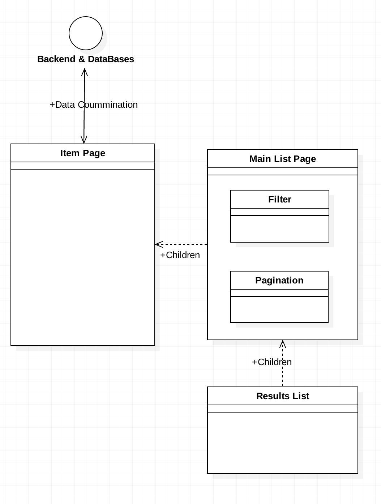

---
# Hi-Cord Blog Project

- Author : [Seol Hun](https://github.com/Seolhun)
- StartedDate : 2017.09.09

## Goal of Hi-Cord
Why develop this project?
- I want that developer connect with others interested in common stacks each other.
    - We already have a nice code hub like 'Git-hub'. so, I want to integrate code and blog information at the same time to manage easily.
    - We will serve the developer-blog based on 'Git-Hub' service. Never have a blog not based on 'Git-Hub'.
    - You can follow good project and developer easily and message, chatting, etc many things can use in Hi-Cord Blog project.
    - Just write a code on 'Git-hub', 'Hi-Cord' serve information for others automatically.

## Enviroment
### Back-end
- Java
    - Spring Boot
    - Spring Security, Oauth2
    - Spring Stomp, Websocket, SockJS
    - Spring Actuator
    - JPA, Hibernate

- Cache
    - Redis or Elastic Cache

- Python (Data Analysis Module)
    - Flask
    - NLP

- AWS
    - Bean Stalk
    - Lambda
    - S3
    - RDB
    - DynamoDB
    - Kinesis

### Front-end
- Vue2 Cli
- Vuex
- TypeScript
- D3.js

---
### Build & Integration System
- Gradle
- Docker
- Travis
- Codacy
- Waffle.io

### Util
- Post Man

---
## Module
- User
- Group
- Pay
- Content
- File
- NLP
- Statistics
- Log

---
## Architecture
### BackEnd Service Architecture

### FrontEnd Components Architecture

---
### Reference Link
##### BackEnd
- [Spring boot - Reference Documentation](https://docs.spring.io/spring-boot/docs/current-SNAPSHOT/reference/htmlsingle/)
    - [Spring Data JPA - Reference Documentation](https://docs.spring.io/spring-data/jpa/docs/current/reference/html/)
- [Hibernate 5](https://docs.jboss.org/hibernate/orm/5.0/devguide/en-US/html/)
    - [Hibernate 5 - About Batch](https://docs.jboss.org/hibernate/orm/5.0/devguide/en-US/html/ch04.html)
- [AWS Documentation](https://aws.amazon.com/ko/documentation/)

- ** Thrid Parties **
    - [Lombok](https://projectlombok.org/)
    - [Gson](https://github.com/google/gson)

---
##### FrontEnd
- [Vue](https://kr.vuejs.org/v2/guide/)
    - [Vue - API](https://kr.vuejs.org/v2/api/)
- [TypeScript](https://www.typescriptlang.org/docs/handbook/basic-types.html)
- [ECMA6](http://es6-features.org/#Constants)
- [Webpack](https://webpack.github.io/)
- [Babel](https://babeljs.io/)

- ** Thrid Parties **
    - [Axios](https://github.com/axios/axios)
    - [Animate CSS](https://daneden.github.io/animate.css/)