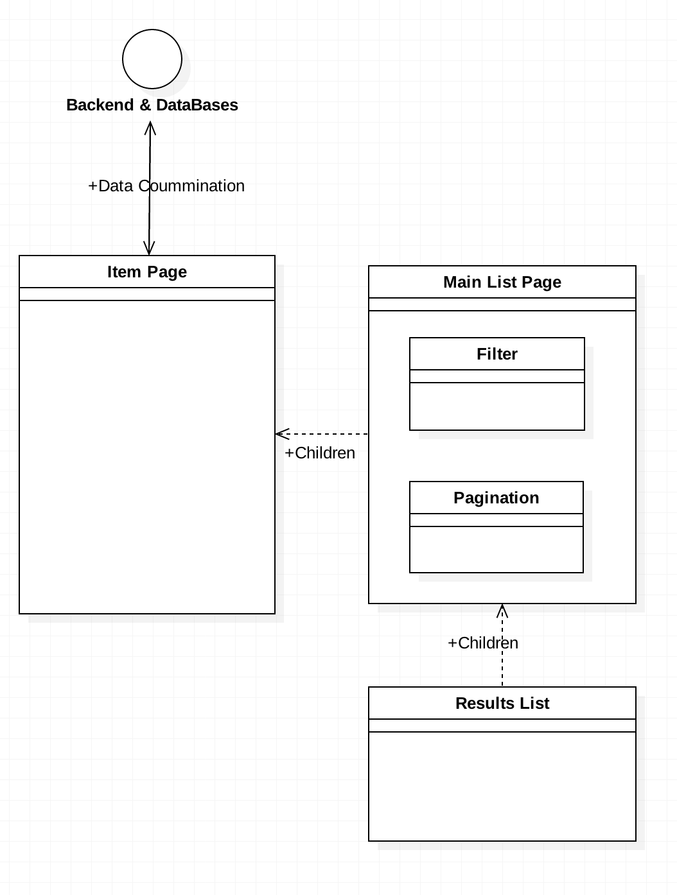

---
# [First-vue](https://github.com/Seolhun/only-vue-project)
- Author : [SeolHun](https://github.com/SeolHun)
- Date : 2017.10.15 
- Docs : [Private Reference Docs](https://github.com/Seolhun/my-business-idea/blob/master/README.md)
---
## Stacks
- IDE
  - WebStorm
- VueJS 2(Vue-Cli)
  - Webpack
- Vuex
- Style
  - SCSS(Custom CSS)
  - ElementUI
  - BootStrap
---
## Goal
1. Understanding front-framework how to run with Vue Cli
2. SPA
  - 1. CRUD Page
  - 2. Result Page
    - Paging & Search(filter) & Multiple List
    - Reusable Vue Components
3. REST(Write once, Use anywhere)
  - Attaching with Backend RestFul Project With Boot, Django, Flask, Anythings.
4. LifeCycle & API
  - Deep Dive Vue LifeCycle & API to use freely.
5. Vuex 
  - To manage event state
6. TypeScript
  - Deep Dive Types & Decorators & Interface, etc.
  
PS. To understand Transition & Animation CSS3

---
## Getting started process
#### Build Setup
- install dependencies
  - npm install

- serve with hot reload at localhost:8080
  - npm run dev

- build for production with minification
  - npm run build

- build for production and view the bundle analyzer report
  - npm run build --report

- run unit tests
  - npm run unit

- run e2e tests
  - npm run e2e

- run all tests
  - npm test

---
For detailed explanation on how things work, checkout the [guide](http://vuejs-templates.github.io/webpack/) and [docs for vue-loader](http://vuejs.github.io/vue-loader).

---
## Reference
1. [VueJS](https://vuejs.org/)
2. [Vue Forum](https://forum.vuejs.org/)

---
## Simple Component Image
1. Item Component

